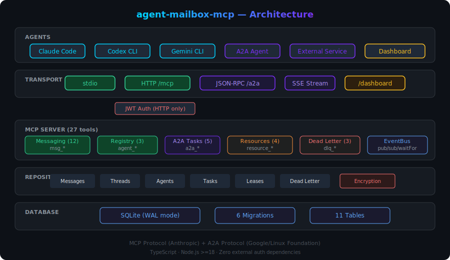
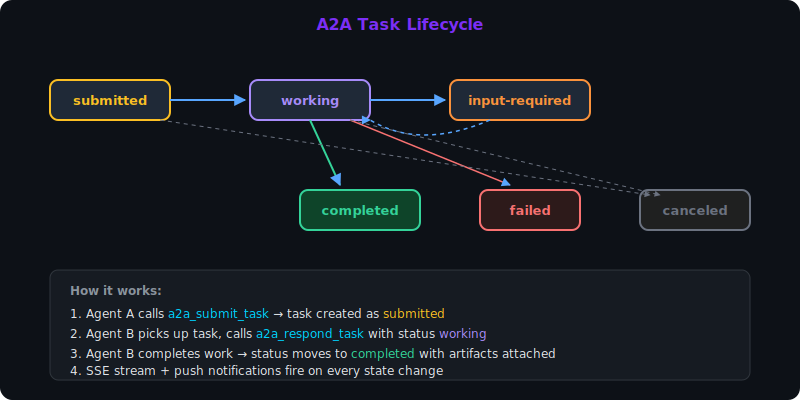

<p align="center">
  
</p>

<h1 align="center">agent-mailbox-mcp</h1>

<p align="center">
  <strong>MCP + A2A messaging server for multi-agent AI systems</strong>
</p>

<p align="center">
  <a href="https://www.npmjs.com/package/agent-mailbox-mcp"></a>
  <a href="https://github.com/lleontor705/agent-mailbox-mcp/actions"></a>
  <a href="https://opensource.org/licenses/MIT"></a>
  <a href="https://nodejs.org"></a>
</p>

<p align="center">
  Mailbox-style messaging · A2A task delegation · Resource coordination · Web dashboard<br>
  Works with <strong>Claude Code</strong>, <strong>Codex CLI</strong>, <strong>Gemini CLI</strong>, and any MCP-compatible client
</p>

---

## Why?

AI agents working in multi-agent systems need to **communicate, delegate tasks, and coordinate resources**. Without a messaging layer:

- Agents can't send results to each other
- No way to delegate complex work to specialized agents
- Multiple agents editing the same file cause conflicts
- Failed or expired messages are silently lost

**agent-mailbox-mcp** provides the messaging infrastructure your agents need — combining [MCP](https://modelcontextprotocol.io/) (agent-to-tools) with [A2A](https://a2aprotocol.ai/) (agent-to-agent) in a single server.

## Architecture

<p align="center">
  
</p>

## Quick Start

```bash
# stdio mode (default — use with Claude Code, Codex, Gemini)
npx -y agent-mailbox-mcp

# HTTP mode (enables A2A, dashboard, SSE streaming)
MAILBOX_TRANSPORT=http npx -y agent-mailbox-mcp
# → Dashboard: http://localhost:4820/dashboard
# → Agent Card: http://localhost:4820/.well-known/agent-card.json
# → A2A endpoint: http://localhost:4820/a2a
```

## Configure Your AI Client

### Claude Code

```bash
claude mcp add agent-mailbox --transport stdio -- npx -y agent-mailbox-mcp
```

### Codex CLI (`~/.codex/config.toml`)

```toml
[mcp_servers.agent-mailbox]
command = "npx"
args = ["-y", "agent-mailbox-mcp"]
```

### Gemini CLI (`settings.json`)

```json
{
  "mcpServers": {
    "agent-mailbox": {
      "command": "npx",
      "args": ["-y", "agent-mailbox-mcp"]
    }
  }
}
```

### VS Code (MCP extension)

```json
{
  "servers": {
    "agent-mailbox": {
      "command": "npx",
      "args": ["-y", "agent-mailbox-mcp"]
    }
  }
}
```

## Features

### Messaging (12 tools)

Send, receive, search, and manage messages between agents with priority, threading, deduplication, and auto-expiration.

```
→ msg_send(sender: "coordinator", recipient: "analyst", subject: "Q1 Report", body: "Generate the Q1 revenue report", priority: "high")
← { sent: true, message_id: "msg-a1b2c3", thread_id: "thr-d4e5f6" }

→ msg_read_inbox(agent: "analyst")
← { count: 1, messages: [{ subject: "Q1 Report", priority: "high", ... }] }

→ msg_acknowledge(message_id: "msg-a1b2c3", reply_body: "Report ready: revenue up 23% QoQ")
```

### A2A Task Delegation (5 tools)

Delegate complex work to specialized agents. Tasks have a full lifecycle with state tracking, artifacts, and streaming.

<p align="center">
  
</p>

```
→ a2a_submit_task(from_agent: "manager", to_agent: "researcher", message: "Find top 5 competitors")
← { task_id: "task-x1y2z3", status: "submitted" }

→ a2a_respond_task(task_id: "task-x1y2z3", message: "Analysis complete: ...", status: "completed", artifact_name: "competitor-report")
```

### Resource Coordination (4 tools)

Advisory locking for files, APIs, or any shared resource. Prevents agents from stepping on each other's work.

```
→ resource_acquire(resource_id: "data/config.yaml", agent: "editor-1", lease_type: "exclusive", ttl_seconds: 60)
← { acquired: true }

→ resource_acquire(resource_id: "data/config.yaml", agent: "editor-2")
← { acquired: false, holder: { agent_id: "editor-1", expires_at: "..." } }
```

### Dead-Letter Queue (3 tools)

Expired and failed messages go to a DLQ instead of being lost. Retry or purge them.

```
→ dlq_list()
← { count: 2, entries: [{ reason: "expired", subject: "Important task", ... }] }

→ dlq_retry(dlq_id: "dlq-abc123")
← { retried: true, new_message_id: "msg-..." }
```

### Web Dashboard

Real-time monitoring of agents, messages, tasks, leases, and DLQ — accessible at `/dashboard` when running in HTTP mode.

### HTTP + A2A Protocol

Full [A2A protocol](https://a2aprotocol.ai/) support over JSON-RPC 2.0:

- **Agent Cards** at `/.well-known/agent-card.json` for discovery
- **SSE Streaming** at `/a2a/tasks/:id/stream` for real-time task updates
- **Push Notifications** via webhooks with exponential backoff retry
- **JWT Authentication** with granular scopes

### Encryption at Rest

Optional AES-256-GCM encryption for message bodies. Set `MAILBOX_ENCRYPTION_KEY` to enable — transparent to tools.

## All 27 Tools

| Category | Tools | Description |
|----------|-------|-------------|
| **Messaging** | `msg_send` `msg_read_inbox` `msg_acknowledge` `msg_broadcast` `msg_search` `msg_request` `msg_list_threads` `msg_get` `msg_delete` `msg_count` `msg_update_status` | Full messaging lifecycle with priority, threading, dedup |
| **Registry** | `agent_register` `msg_list_agents` `msg_activity_feed` | Agent discovery and monitoring |
| **A2A Tasks** | `a2a_submit_task` `a2a_get_task` `a2a_cancel_task` `a2a_list_tasks` `a2a_respond_task` | Task delegation with state machine |
| **Resources** | `resource_acquire` `resource_release` `resource_check` `resource_list` | Advisory resource leasing |
| **Dead Letter** | `dlq_list` `dlq_retry` `dlq_purge` | Failed message recovery |

## Environment Variables

| Variable | Default | Description |
|----------|---------|-------------|
| `MAILBOX_DIR` | `~/.agent-mailbox` | Database directory |
| `MAILBOX_DB` | `~/.agent-mailbox/mailbox.db` | Full database path |
| `MAILBOX_TTL` | `86400` | Message TTL in seconds (default 24h) |
| `MAILBOX_PORT` | `4820` | HTTP server port |
| `MAILBOX_TRANSPORT` | `stdio` | Transport: `stdio`, `http`, or `both` |
| `MAILBOX_AUTH_SECRET` | — | JWT signing secret (empty = auth disabled) |
| `MAILBOX_ENCRYPTION_KEY` | — | AES-256-GCM key (empty = no encryption) |

## Documentation

| Guide | Description |
|-------|-------------|
| [Getting Started](docs/getting-started.md) | Installation, configuration, first message |
| [Tools Reference](docs/tools-reference.md) | All 27 tools with parameters and examples |
| [A2A Protocol Guide](docs/a2a-guide.md) | Task delegation, Agent Cards, streaming, webhooks |
| [Examples](docs/examples.md) | Real-world usage patterns |
| [Skill Guide](docs/SKILL.md) | Guide for AI agents on how to use the mailbox |

## Development

```bash
git clone https://github.com/lleontor705/agent-mailbox-mcp.git
cd agent-mailbox-mcp
npm install
npm run dev          # stdio server
npm run serve        # HTTP server with dashboard
npm test             # 111 tests
npm run build        # TypeScript compilation
npm run inspect      # MCP inspector
```

## Tech Stack

- **TypeScript** with strict mode
- **SQLite** (WAL mode) via better-sqlite3 — zero external services
- **Express** for HTTP transport
- **MCP SDK** (@modelcontextprotocol/sdk) for protocol compliance
- **Zod** for runtime input validation
- **Node.js crypto** for JWT and AES-256-GCM — zero auth dependencies

## License

MIT
